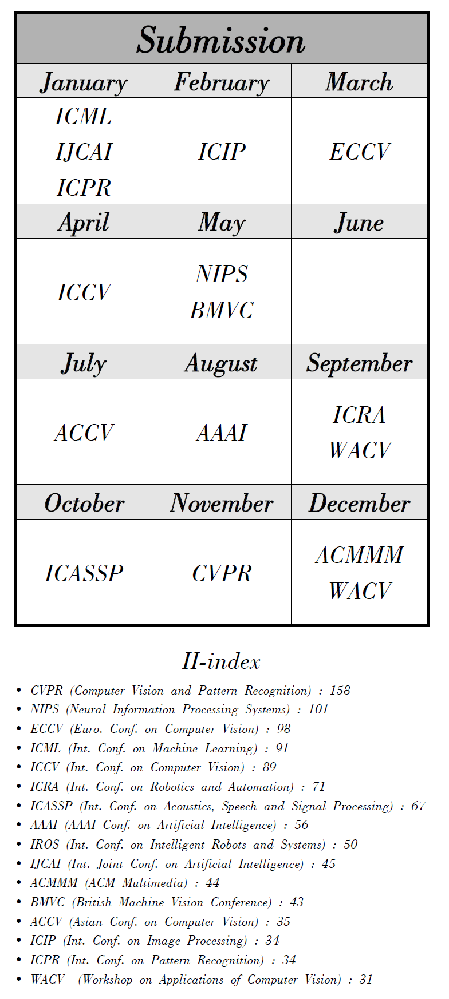

## Conference Calendar (ver. 2018/09)

---
## Major

### [*Computer science*](http://www.guide2research.com/topconf/)
#### [- Image Processing & Computer Vision](http://www.guide2research.com/topconf/computer-vision)
#### [- Machine Learning & Arti. Intelligence](http://www.guide2research.com/topconf/machine-learning)
#### [- Signal Processing](http://www.guide2research.com/topconf/signal-processing)

-----
## H-index

* CVPR (Computer Vision and Pattern Recognition) : 158
* NIPS (Neural Information Processing Systems) : 101
* ECCV (Euro. Conf. on Computer Vision) : 98
* ICML (Int. Conf. on Machine Learning) : 91
* ICCV (Int. Conf. on Computer Vision) : 89
* ICRA (Int. Conf. on Robotics and Automation) : 71
* ICASSP (Int. Conf. on Acoustics, Speech and Signal Processing) : 67
* AAAI (AAAI Conf. on Artificial Intelligence) : 56
* IROS (Int. Conf. on Intelligent Robots and Systems) : 50
* IJCAI (Int. Joint Conf. on Artificial Intelligence) : 45
* ACMMM (ACM Multimedia) : 44
* BMVC (British Machine Vision Conference) : 43
* ACCV (Asian Conf. on Computer Vision) : 35
* ICIP (Int. Conf. on Image Processing) : 34
* ICPR (Int. Conf. on Pattern Recognition) : 34
* WACV  (Workshop on Applications of Computer Vision) : 31

---

## Reference

http://www.guide2research.com/
